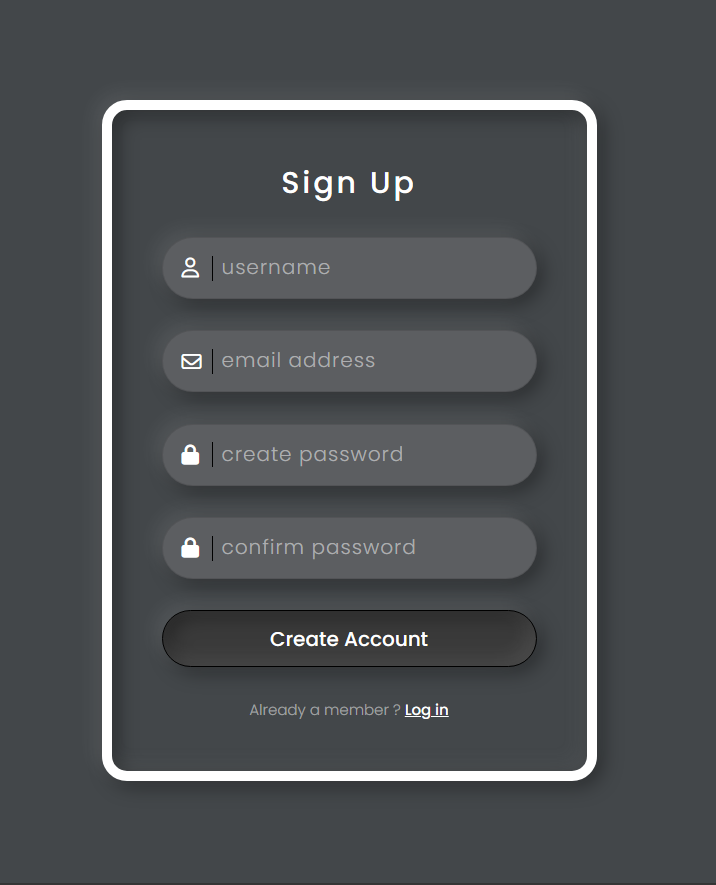
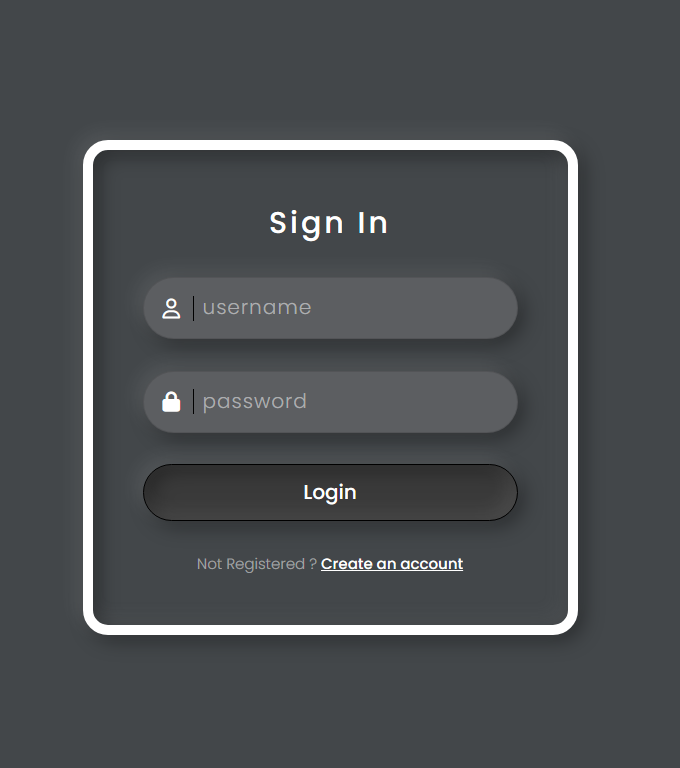

# Login Registration Form

## Description

This is a simple login registration form created using HTML and CSS. It provides fields for users to input their username, email, password, and confirm password for registration, and for returning users to log in using their credentials.

## Files

1. `index.html`: Contains the HTML structure for the login registration form.
2. `style.css`: Contains the CSS styling for the form.
3. `screenshot.png`: Screenshot of the login registration form.

## Instructions

1. Download or clone the repository to your local machine.
2. Open `index.html` in a web browser to view the login registration form.
3. Enter your credentials to register or log in.

## Credits

- Developed by [Shivanshu Singh]
- Contact: [sivanshusingh2004@gmail.com]

